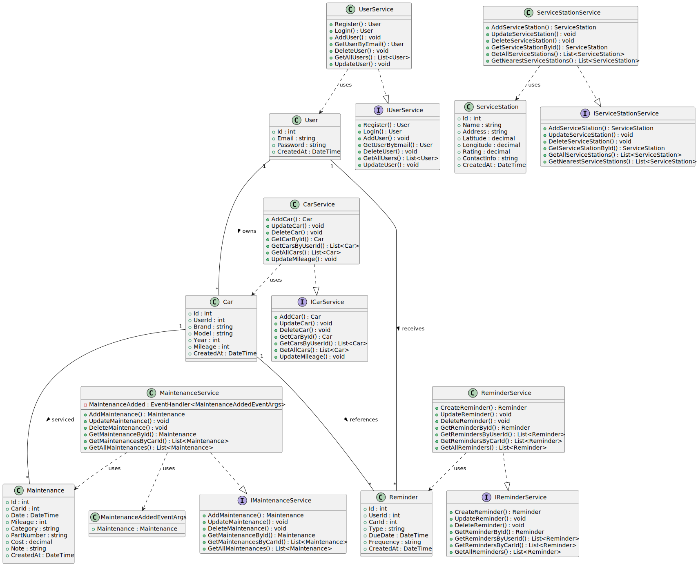

# Приложение для учета ТО (Антонова Лидия Сергеевна [353504])

**Описание проекта:**  Мобильное приложение для учета технического обслуживания — это инструмент для владельцев автомобилей, который помогает отслеживать расходы на обслуживание, напоминает о плановом обслуживании и упрощает управление важными данными. Приложение также предоставляет карту ближайших станций технического обслуживания (СТО) и поддерживает систему авторизации пользователей.

## **Функциональные требования**

### **Учет ремонта и запчастей**
- Пользователь может вводить информацию о проведении ремонта, замене запчастей и страховке через интуитивно понятный интерфейс.
- Записи включают:
  - Дату проведения работ.
  - Пробег автомобиля на данный момент.
  - Стоимость работ или запчастей.
  - Артикулы деталей.
  - Заметки пользователя.
- Возможность добавления пользовательских категорий (например, «Шины», «Тормозная жидкость»).

---

### **Напоминания**
- Создание напоминаний о важных действиях, таких как техническое обслуживание, замена масла или страховка.
- Настройка уведомлений, чтобы они появлялись за определённое время до события.
- Возможность настроить частоту напоминаний (например, ежегодно, каждые 10 000 км).

---

### **История обслуживания**
- Приложение сохраняет полную историю всех произведённых работ.
- Возможность фильтрации записей по категориям (например, «ТО», «Ремонт двигателя»).

---

### **Карта СТО**
- Приложение автоматически определяет местоположение пользователя.
- Отображение ближайших станций технического обслуживания на карте.

---

### **Управление данными**
- Возможность добавления и управления несколькими автомобилями.
- Для каждого автомобиля создаётся отдельный профиль с уникальной информацией (например, марка, модель, год выпуска, пробег).

---

### **Авторизация пользователей**
- Регистрация и вход в систему через электронную почту.

---

### **Синхронизация**
- Данные пользователя хранятся в облаке, обеспечивая их доступность на нескольких устройствах.
- Синхронизация выполняется автоматически при подключении к интернету.

## **Class diagram** 

## **Описание моделей данных**

### **User (Пользователь)**
- **id (integer):** Уникальный идентификатор пользователя.
- **email (string):** Адрес электронной почты для авторизации.
- **password (string):** Хэшированный пароль.
- **created_at (datetime):** Дата регистрации пользователя.

---

### **Car (Автомобиль)**
- **id (integer):** Уникальный идентификатор автомобиля.
- **user_id (integer):** Ссылка на идентификатор пользователя (владелец).
- **brand (string):** Марка автомобиля.
- **model (string):** Модель автомобиля.
- **year (integer):** Год выпуска.
- **mileage (integer):** Пробег автомобиля.
- **created_at (datetime):** Дата добавления автомобиля.

---

### **Maintenance (Обслуживание)**
- **id (integer):** Уникальный идентификатор записи.
- **car_id (integer):** Ссылка на идентификатор автомобиля.
- **date (date):** Дата проведения работ.
- **mileage (integer):** Пробег на момент обслуживания.
- **category (string):** Категория работы (например, «Замена масла», «Ремонт тормозов»).
- **part_number (string):** Артикулы использованных запчастей (опционально).
- **cost (decimal):** Стоимость работы (опционально).
- **note (text):** Дополнительные заметки.
- **created_at (datetime):** Дата добавления записи.

---

### **Reminder (Напоминания)**
- **id (integer):** Уникальный идентификатор напоминания.
- **user_id (integer):** Ссылка на идентификатор пользователя.
- **car_id (integer):** Ссылка на идентификатор автомобиля.
- **type (string):** Тип напоминания (например, замена масла, техосмотр).
- **due_date (date):** Дата, до которой нужно выполнить задачу.
- **frequency (string):** Частота (например, ежегодно, каждые 10 000 км).
- **created_at (datetime):** Дата создания напоминания.

---

### **ServiceStation (СТО)**
- **id (integer):** Уникальный идентификатор СТО.
- **name (string):** Название станции.
- **address (string):** Адрес станции.
- **latitude (decimal):** Широта (для карты).
- **longitude (decimal):** Долгота (для карты).
- **rating (decimal):** Рейтинг (опционально).
- **contact_info (string):** Контактные данные.
- **created_at (datetime):** Дата добавления записи.
